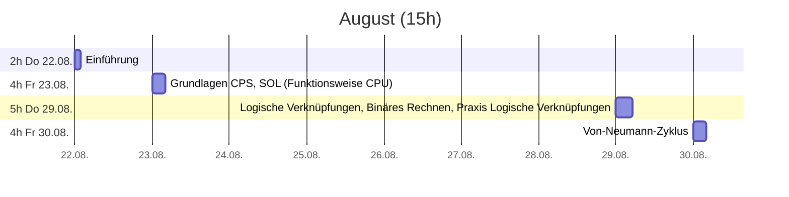
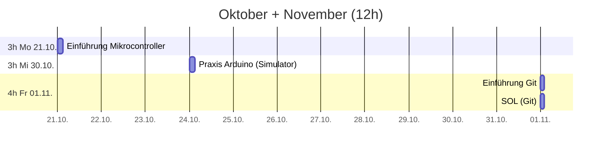
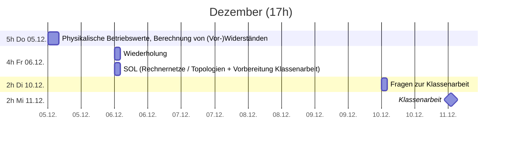
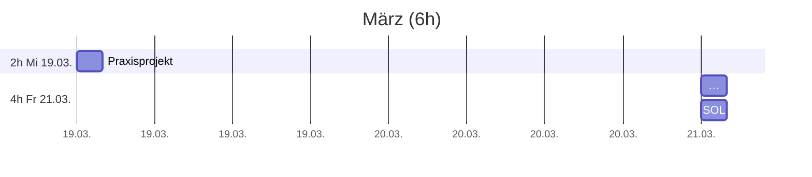
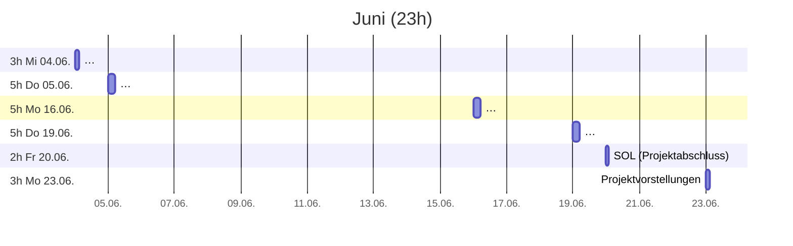

# Plan

## Zeitplan




```mermaid
gantt
 title Januar (13h)
 dateFormat YYYY-MM-DD
 axisFormat %d.%m.
 section 3h Do 22.01.
  OSI-Modell (Physical Layer) :2025-01-23, 3h
 section 5h Do 23.01.
  UART, I²C, SPI              :2025-01-23, 5h
 section 4h Fr 24.01.
  HTTP, MQTT                  :n2025-01-24, 2h
  SOL (Vorbereitung Klassenarbeit)  :2025-01-24, 2h
 section 3h Di 28.01.
  Wiederholung                :2025-01-23, 3h
 section 4h Fr 31.01.
  Klassenarbeit               :milestone, 2025-01-31, 2h
  SOL (Projektplanung)        :2025-01-31, 2h
```



## Leistungskontrollen

* Soll Notendichte: 7 
* Minimum Klassenarbeiten (>45min, doppelte Wertung): 2
* Sonstige Noten: >=3

> * **1. Klassenarbeit 11.12.** ~90min (einseitig beschrifteter A4 Notizzettel + 1 einfacher Taschenrechner ohne Binärberechnungen)
>   * Grundlagen CPS
>   * Zweierpotenzen
>   * [Logische Verknüpfungen](./prozessor.md#Logikgatter) (Not, And, Or, XOr)
>     * Wahrheitswertetabelle
>     * Logik Gatter (Schaltung mit einfachen (Um-)Schaltern)
>   * Von-Neumann-Zyklus
>   * Berechnung von (Vor-)Widerständen
>   * Rechnernetze / Topologien
>   * [Grundlagen Git](./git.md)

> * **2. Klassenarbeit 31.01.** ~90min (einseitig beschrifteter A4 Notizzettel)
>   * OSI-Modell, insbesondere Physical Layer
>   * UART, I²C, SPI
>   * HTTP, MQTT
>   * Grundlagen Programmierung (Variablen, While, If/Else)
