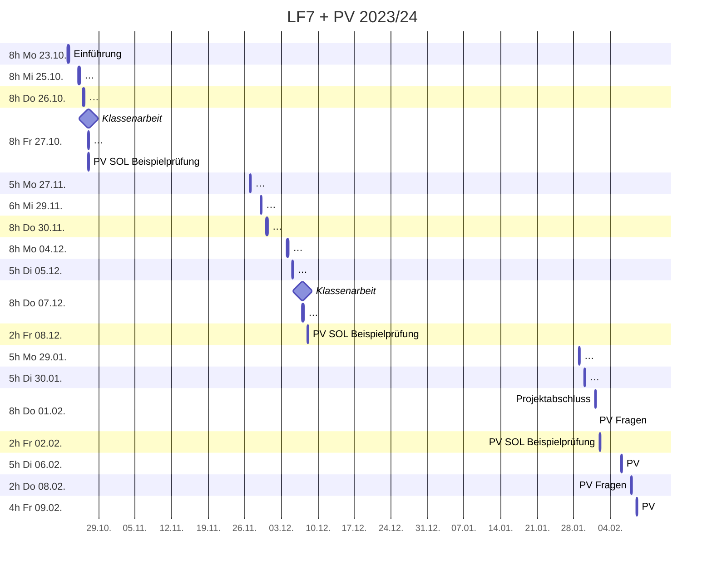

# Plan

## Zeitplan

## Leistungskontrollen

* Soll Notendichte: 7 
* Minimum Klassenarbeiten (>45min, doppelte Wertung): 2
* Sonstige Noten: >=3

> * **Fr 27.10. Klassenarbeit** ~90min (einseitig beschrifteter A4 Notizzettel + 1 einfacher Taschenrechner ohne Binärberechnungen)
>   * Zweierpotenzen
>   * Logische Verknüpfungen (Not, And, Or, XOr)
>     * Wahrheitswertetabelle
>     * Logik Gatter (Schaltung mit einfachen (Um-)Schaltern)
>   * Von-Neumann-Zyklus
>   * Berechnung von (Vor-)Widerständen
>   * Rechnernetze / Topologien

> * **Do 07.12. Klassenarbeit** ~90min (einseitig beschrifteter A4 Notizzettel)
>   * Grundlagen Programmierung (Variablen, While, If/Else)
>   * [Grundlagen Git](https://johannesloetzsch.github.io/linux-praktikum/versionskontrolle.html)
>   * OSI-Modell, insbesondere Physical Layer
>   * UART, I²C, SPI
>   * HTTP, MQTT

## Checkliste

### Mo 23.10.
> - [x] Dokumentation mit [hedgedoc](https://hedgedoc.c3d2.de/) und [mdBook](https://rust-lang.github.io/mdBook/)
> - [x] Git Kurzeinführung (machen wir später noch ausführlicher)
>   * [OhMyGit](https://ohmygit.org/)
> - [x] Allgemeine Infos (Unterrichtskonzept)
> - [x] Übersicht LF7 + PV
> - [x] Grundlagen CPS
> - [.] Schnittstellen
>   - [ ] Logik Gatter
>   - [ ] Von-Neumann-Zyklus

### Mi 25.10.
> - [x] Grundlagen digitaler Schaltungen
>   - [x] Logische Verknüpfungen (Not, And, Or, XOr)
>     - [x] Wahrheitswertetabelle
>     - [x] Logik Gatter (Schaltung mit einfachen (Um-)Schaltern)
>     - [x] Logik Gatter mit Resistor-Transistor-Logik
>       - [x] (Halb-)Addierer
>   - [x] Berechnung von (Vor-)Widerständen

### Do 26.10.
> - [x] Von-Neumann-Zyklus
> - [x] Rechnernetze -> Bussysteme
> - [x] Integration -> Schnittstellen
> -   [.] -> Standards

### Fr 27.10.
> - [x] Klassenarbeit
> - [x] Integration -> Schnittstellen -> Standards
> - [x] Sortieralgorithmen
> - [x] SOL: Klausuraufgabe

### Mo 27.11. + Mi 29.11.
> - [x] Einführung Raspberry Pi
> - [x] GPIO (Leds+Buttons)
> - [x] Grundlagen Programmierung

### Do 30.11.
> - [x] Vorstellung von Ergebnissen vom 29.11.
> - [x] OSI Modell
> - [x] Bitübertragung
> - [x] UART, I²C, SPI
> - [x] Vorschläge für weitere Raspberry-Projekte
> - [x] Zeit für Praxisprojekte mit Raspberry Pi

### Mo 4.12.
> - [x] HTTP, MQTT
> - [ ] [Grundlagen Git](https://johannesloetzsch.github.io/linux-praktikum/versionskontrolle.html)
> - [ ] CTF
> - [ ] Arduino?
### Di 5.12.
> - [ ] Wiederholung für Klassenarbeit
> - [ ] Zeit für Praxisprojekte
### Do 7.12.
> - [ ] Klassenarbeit
### Fr 8.12.
> - [ ] SOL: Klausuraufgabe? 
