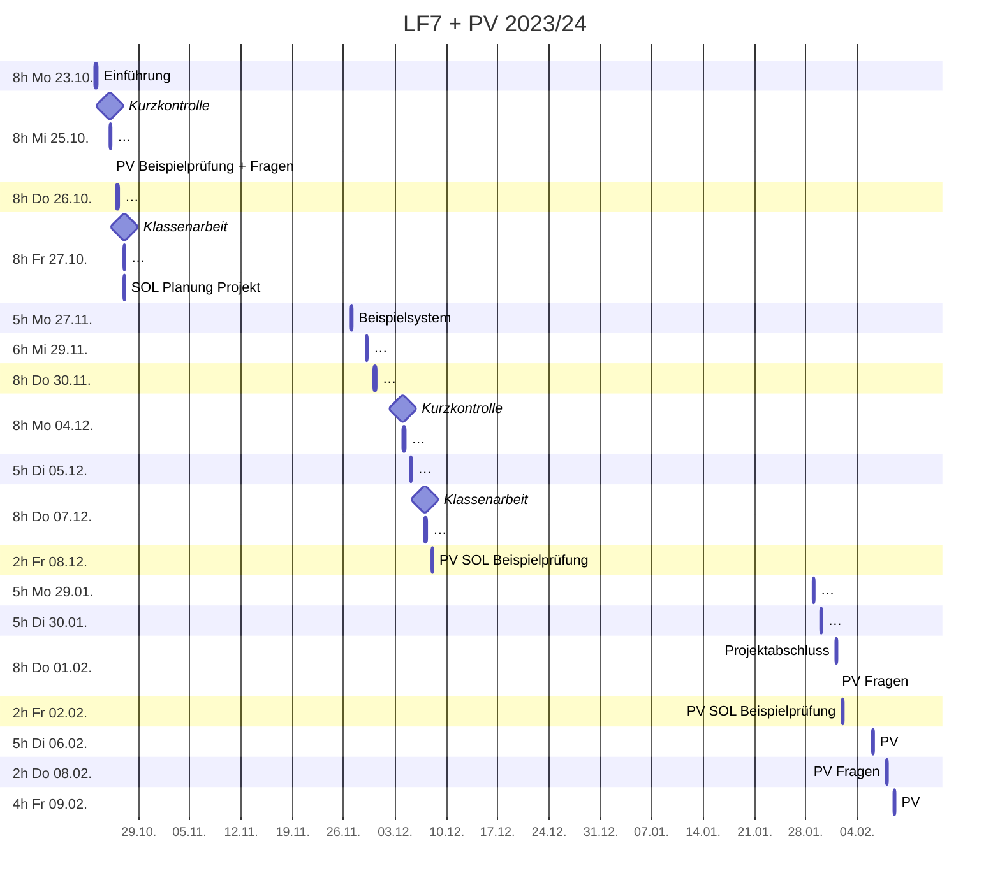

# Plan

## Zeitplan

## Leistungskontrollen

* Soll Notendichte: 7 
* Minimum Klassenarbeiten (>45min, doppelte Wertung): 2
* Sonstige Noten: >=3

> * ~~Mi 25.10. Kurzkontrolle 40min~~
> * **Fr 27.10. Klassenarbeit** ~90min (einseitig beschrifteter A4 Notizzettel + 1 einfacher Taschenrechner ohne Binärberechnungen)
>   * Zweierpotenzen
>   * Logische Verknüpfungen (Not, And, Or, XOr)
>     * Wahrheitswertetabelle
>     * Logik Gatter (Schaltung mit einfachen (Um-)Schaltern)
>   * Von-Neumann-Zyklus
>   * Berechnung von (Vor-)Widerständen
>   * Rechnernetze / Topologien
> * **Mo 04.12.** Kurzkontrolle
> * **Do 07.12. Klassenarbeit**

## Checkliste

### Mo 23.10.
> - [x] Dokumentation mit [hedgedoc](https://hedgedoc.c3d2.de/) und [mdBook](https://rust-lang.github.io/mdBook/)
> - [x] Git Kurzeinführung (machen wir später noch ausführlicher)
>   * [OhMyGit](https://ohmygit.org/)
> - [x] Allgemeine Infos (Unterrichtskonzept)
> - [x] Übersicht LF7 + PV
> - [x] Grundlagen CPS
> - [.] Schnittstellen
>   - [ ] Logik Gatter
>   - [ ] Von-Neumann-Zyklus

### Mi 25.10.
> - [x] Grundlagen digitaler Schaltungen
>   - [x] Logische Verknüpfungen (Not, And, Or, XOr)
>     - [x] Wahrheitswertetabelle
>     - [x] Logik Gatter (Schaltung mit einfachen (Um-)Schaltern)
>     - [x] Logik Gatter mit Resistor-Transistor-Logik
>       - [x] (Halb-)Addierer
>   - [x] Berechnung von (Vor-)Widerständen

### Do 26.10.
> - [x] Von-Neumann-Zyklus
> - [x] Rechnernetze -> Bussysteme
> - [x] Integration -> Schnittstellen
> -   [.] -> Standards

### Fr 27.10.
> - [ ] Klassenarbeit
> - [ ] Integration -> Schnittstellen -> Standards
> - [ ] OSI Modell
> - [ ] Bitübertragung
> - [ ] Sortieralgorithmen (?)
>  - [ ] Klausuraufgabe (?)
