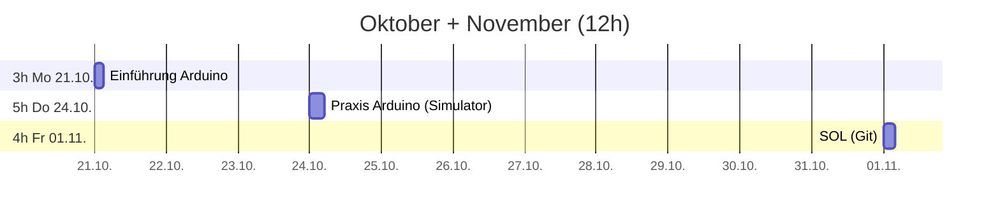
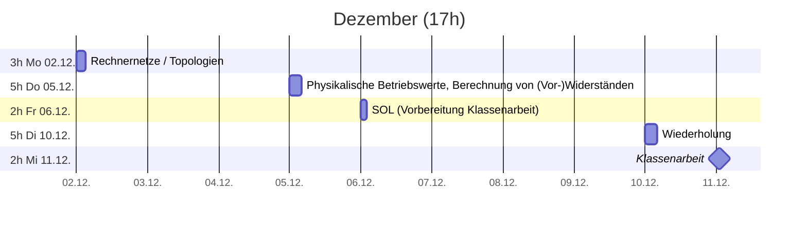
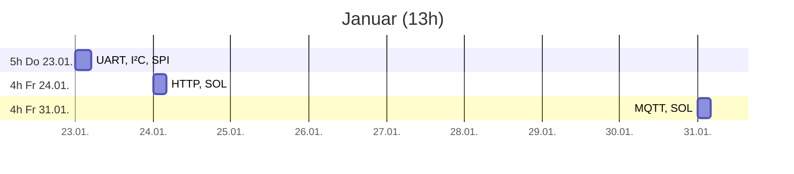
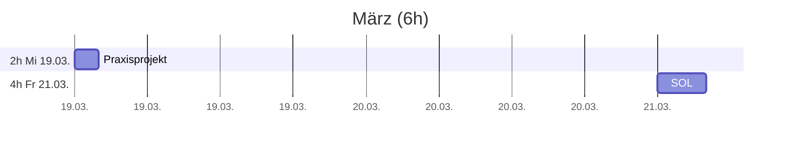
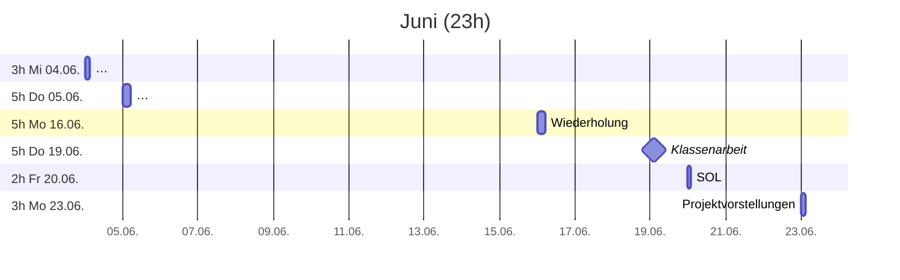

# Plan

## Zeitplan

## Leistungskontrollen

* Soll Notendichte: 7 
* Minimum Klassenarbeiten (>45min, doppelte Wertung): 2
* Sonstige Noten: >=3

> * **1. Klassenarbeit 11.12.** ~90min (einseitig beschrifteter A4 Notizzettel + 1 einfacher Taschenrechner ohne Binärberechnungen)
    * Grundlagen CPS
>   * Zweierpotenzen
>   * Logische Verknüpfungen (Not, And, Or, XOr)
>     * Wahrheitswertetabelle
>     * Logik Gatter (Schaltung mit einfachen (Um-)Schaltern)
>   * Von-Neumann-Zyklus
>   * Berechnung von (Vor-)Widerständen
>   * Rechnernetze / Topologien

> * **2. Klassenarbeit 19.06.** ~90min (einseitig beschrifteter A4 Notizzettel)
>   * Grundlagen Programmierung (Variablen, While, If/Else)
>   * Grundlagen Git
>   * OSI-Modell, insbesondere Physical Layer
>   * UART, I²C, SPI
>   * HTTP, MQTT
