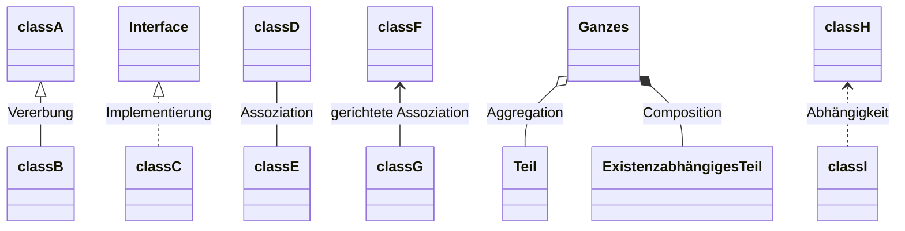

# UML
(LF5)

## [Entity-Relationship-Modell (ERM)](https://de.wikipedia.org/wiki/Entity-Relationship-Modell)

* Entität (Entity)
* Eigenschaft (Attribute)
* Beziehung (Relationship)
  * Kardinalität

### Beispiel

### Aufgaben
* Herbst 2023: Aufgabe 4

## Klassendiagramm

* Klassen
* Schnittstellen (Interface)
* Attribute
* Methoden
* Sichtbarkeiten
  * **+** Public
  * **~** Package
  * **#** Protected (Zugriff durch Klasse selbst und ihre Unterklassen)
  * **-** Private
* Datentypen

* Relationen:

* Kardinalitäten

### Beispiel

### Aufgaben
* Herbst 2023: Aufgabe 4

## [Anwendungsfalldiagramm (Use Case)](https://de.wikipedia.org/wiki/Anwendungsfalldiagramm)

* Akteure
* Systemgrenzen
* Anwendungsfälle
* Assoziation
* include-Beziehungen, extend-Beziehungen

### Beispiel

### Aufgaben
* Herbst 2023: Aufgabe 1

## Weitere

### Sequenzdiagramm

### [Zustandsdiagramm](https://de.wikipedia.org/wiki/Zustandsdiagramm_(UML))

# [Programmablaufplan (PAP)](https://de.wikipedia.org/wiki/Programmablaufplan) / Flowchart

* Start/Stop
* Operation
* Ein-/Ausgabe
* (Unterprogramm)
* Entscheidungen
* Pfeile

### Beispiel

