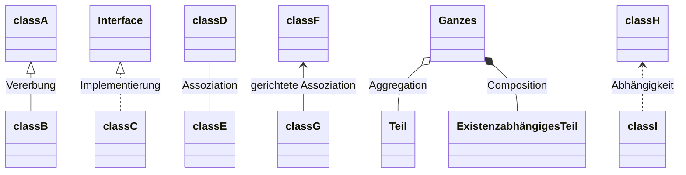

# UML
(LF5)

* UML-Diagramme für logischen Aufbau (statische Sicht):
  - Klassendiagramme
  - *Objektdiagramme*
  - *Paketdiagramme*
  - *Kollaborationsdiagramme*
* UML-Diagramme für Interaktionen/Abläufe (dynamische Sicht):
  - Aktivitätsdiagramme
  - Sequenzdiagramme
  - Zustandsdiagramme

> Prüfung Teil 2 SI Winter 2021 Konzeption, Aufgabe 3cd)

## [Entity-Relationship-Modell (ERM)](https://de.wikipedia.org/wiki/Entity-Relationship-Modell)

* Entität (Entity)
* Eigenschaft (Attribute)
* Beziehung (Relationship)
  * Kardinalität

### Beispiel

> Prüfung Teil 1 Herbst 22

> Prüfung Teil 1 Herbst 23 Aufgabe 4

## Klassendiagramm

* Klassen
* Schnittstellen (Interface)
* Attribute
* Methoden
* Sichtbarkeiten
  * **+** Public
  * **~** Package
  * **#** Protected (Zugriff durch Klasse selbst und ihre Unterklassen)
  * **-** Private
* Datentypen

* Relationen:

* Kardinalitäten

### Beispiel

> Prüfung Teil 1 Herbst 19: Aufgabe 3

> Prüfung Teil 1 Frühjahr 23: Aufgabe 4

> Prüfung AE Winter 21 Planung

> Prüfung AE Sommer 22 Planung

## [Anwendungsfalldiagramm (Use Case)](https://de.wikipedia.org/wiki/Anwendungsfalldiagramm)

* Akteure
* Systemgrenzen
* Anwendungsfälle
* Assoziation
* include-Beziehungen, extend-Beziehungen

### Beispiel

> Prüfung Teil 1 Herbst 23: Aufgabe 1

> Prüfung AE Sommer 09 <!-- Fahrradkurier -->

> Prüfung AE Winter 16, Aufgabe 1  <!-- Wings GmbH -->

> Prüfung AE Winter 21 Planung

## Sequenzdiagramm

> Prüfung SI Winter 21 Analyse Aufgabe 3 [(SSL/TLS)](https://johannesloetzsch.github.io/LF11b/netzwerksicherheit.html)

> Prüfung AE Sommer 22 Planung

> Prüfung AE Winter 23 Umsetzung Aufgabe 1

## [Aktivitätsdiagramm](https://de.wikipedia.org/wiki/Aktivit%C3%A4tsdiagramm)

> Prüfung AE Winter 21 Entwicklung

> Prüfung SI Sommer 22 Konzeption

> Prüfung AE Winter 22 Entwicklung

> Prüfung AE Winter 23 Planung Aufgabe 2c

## [Zustandsdiagramm](https://de.wikipedia.org/wiki/Zustandsdiagramm_(UML))

> Prüfung AE Winter 22 Planung

# [Programmablaufplan (PAP)](https://de.wikipedia.org/wiki/Programmablaufplan) / Flowchart

* Start/Stop
* Operation
* Ein-/Ausgabe
* (Unterprogramm)
* Entscheidungen
* Pfeile

> Prüfung AE Winter 22 Entwicklung

> Prüfung AE Sommer 22 Entwicklung

### Beispiel

