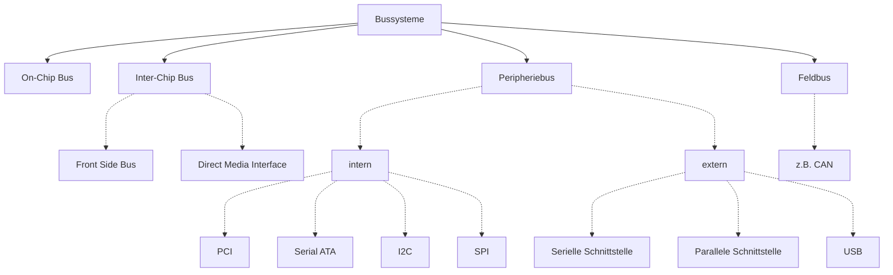

# Rechnernetze

## [Topologien](https://de.wikipedia.org/wiki/Topologie_(Rechnernetz))

> Welche Topologien kennt ihr? Wo finden sie Anwendung?

> Welche Vor- und Nachteile haben verschiedene Topologien?

## Bussysteme

> Für welche Einsatzzwecke sind Bussysteme attraktiv? Warum?

### I²C

* Master-Slave-Bus
* zwei Signalleitungen
  * SCL = Serial Clock
  * SDA = Serial Data

### SPI
(**S**erial **P**eripheral **I**nterface)

