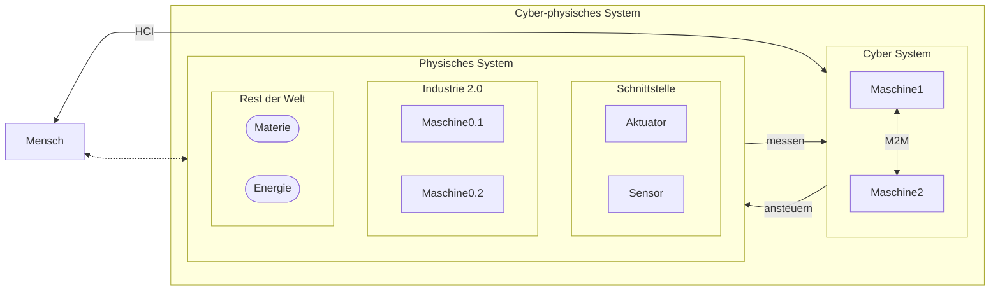
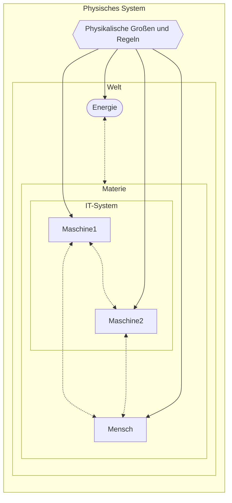
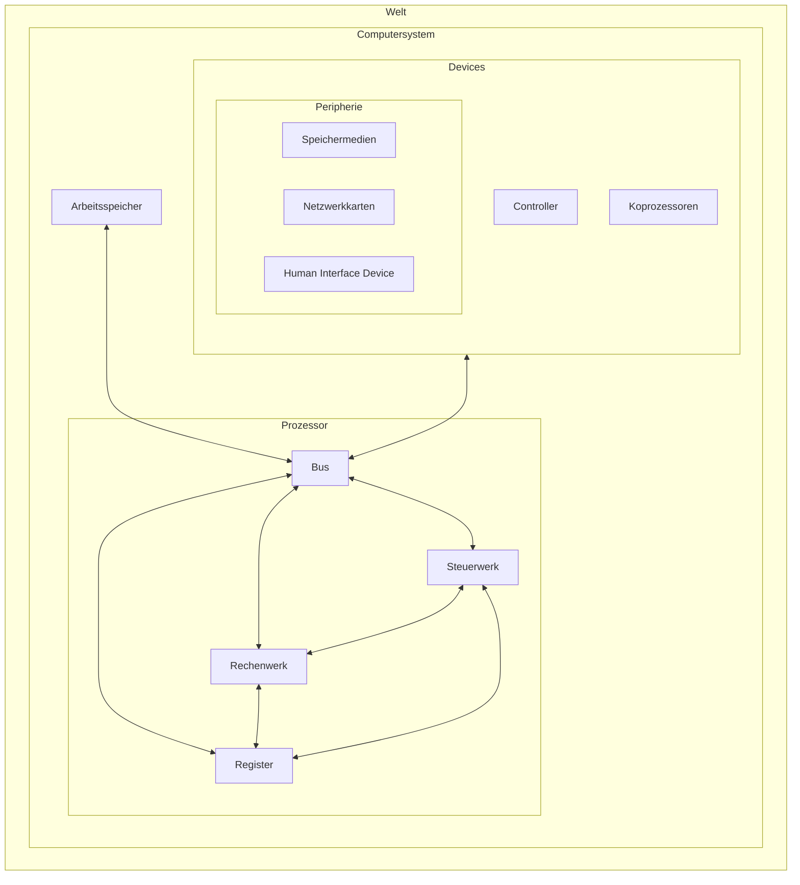
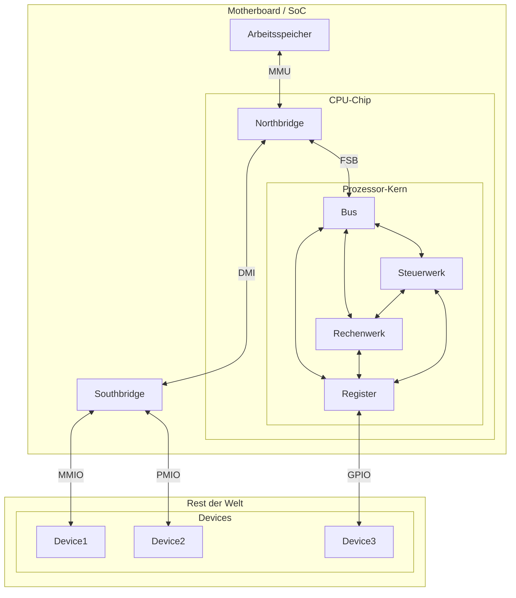

# Schnittstellen

## Mensch — Cyber — Physik ???

### „Aus CPS-Sicht“

HCI vs M2M vs CPS

#### HCI
(**H**uman–**c**omputer **i**nteraction / **H**uman-**c**omputer **I**nterface)

-> **M**ensch-**M**aschine-**I**nteraktion / Benutzerschnittstelle

#### M2M
(Machine-to-Machine)

#### CPS
(**C**yber-**p**hysical **s**ystem)

#### [„Industrie 4.0“](https://de.wikipedia.org/wiki/Industrie_4.0)
1. industrielle Revolution bestand in der Mechanisierung mittels Wasser- und Dampfkraft
2. industrielle Revolution geprägt durch Massenfertigung mit Hilfe von Fließbändern und elektrischer Energie
3. industrielle Revolution oder digitale Revolution mit Einsatz von Elektronik und IT (v. a. die speicherprogrammierbare Steuerung und die CNC-Maschine)
4. industrielle Revolution: [Smart Factory](https://de.wikipedia.org/wiki/Smart_Factory) und [**I**ndustrial **i**nternet **o**f **t**hings](https://en.wikipedia.org/wiki/Industrial_internet_of_things)

### „Aus Sicht der Physik“

### „Aus Sicht eines [Prozessors](https://de.wikipedia.org/wiki/Prozessor#Verarbeitung_eines_einzelnen_Befehls)“
(**Rechnerarchitektur** / **Prozessorarchitektur**)

#### stark vereinfacht

#### detailierter

##### [SoC](https://de.wikipedia.org/wiki/System-on-a-Chip)
(**S**ystem-**o**n-a-**C**hip)

##### [FSB](https://de.wikipedia.org/wiki/Front_Side_Bus)
(**F**ront **S**ide **B**us)

##### [DMI](https://de.wikipedia.org/wiki/Direct_Media_Interface)
(**D**irect **M**edia **I**nterface)

##### [MMU](https://de.wikipedia.org/wiki/Memory_Management_Unit)
(**M**emory **M**anagement **U**nit)

##### [MMIO](https://de.wikipedia.org/wiki/Memory_Mapped_I/O)
(**M**emory-**m**apped **I**/**O**)

##### [PMIO](https://de.wikipedia.org/wiki/Memory_Mapped_I/O)
(**P**ort-**m**apped **I**/**O**)

##### [GPIO](https://de.wikipedia.org/wiki/GPIO)
(**G**eneral **P**urpose **I**nput/**O**utput)

#### [Von-Neumann-Zyklus](https://de.wikipedia.org/wiki/Von-Neumann-Zyklus)
1. `FETCH` (Befehlsabruf):
    * Nächsten Befehl (entsprechend Adresse im Befehlszähler) aus Arbeitsspeicher in das Befehlsregister laden und Befehlszähler inkrementieren
2. `DECODE`(Dekodierung):
    * Der Befehl wird durch das Steuerwerk in Schaltinstruktionen für das Rechenwerk aufgelöst
3. `FETCH OPERANDS`(Operandenabruf):
    * Operanden werden aus dem Speicher laden
4. `EXECUTE` (Befehlsausführung):
    * Arithmetische oder logische Operation wird vom Rechenwerk berechnet. *(Bei Sprungbefehlen und erfüllter Sprungbedingung wird der Befehlszähler angepasst)*
5. `WRITE BACK` (Rückschreiben des Resultats): Ergebnis der Berechnung wird in den Speicher zurückgeschrieben *(falls nötig)*

> Was ist die „richtige“ Sichtweise?
