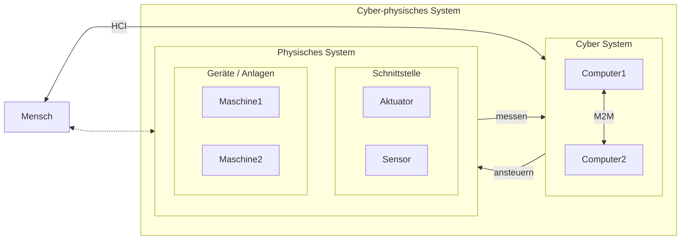
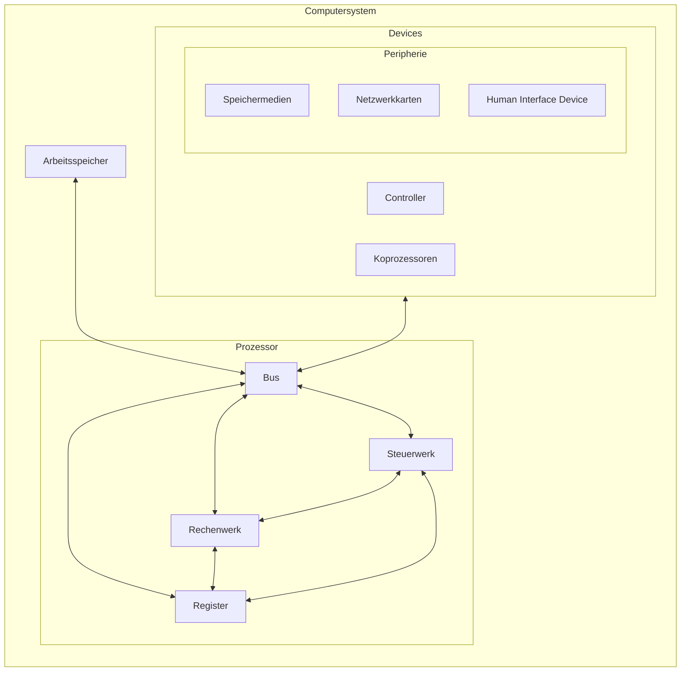
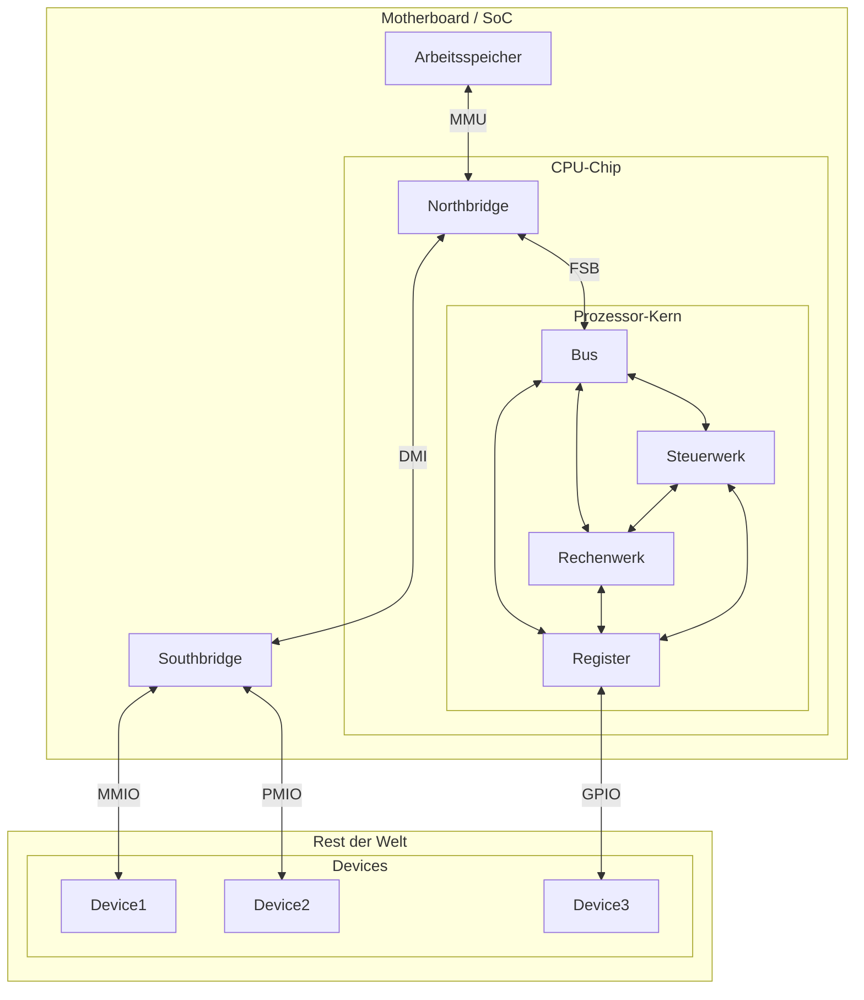

# Schnittstellen

 Wie kommunizieren **Mensch**, „**Cyber**“ und **Physik** miteinander?

### „Aus CPS-Sicht“

HCI vs M2M vs CPS

#### HCI
(**H**uman–**c**omputer **i**nteraction / **H**uman-**c**omputer **I**nterface)

-> **M**ensch-**M**aschine-**I**nteraktion / Benutzerschnittstelle

#### M2M
(Machine-to-Machine)

#### CPS
(**C**yber-**p**hysical **s**ystem)

### „Aus Sicht eines [Prozessors](https://de.wikipedia.org/wiki/Prozessor#Verarbeitung_eines_einzelnen_Befehls)“
(**Rechnerarchitektur** / **Prozessorarchitektur**)

> IHK-Zwischenprüfung Herbst 2018: Aufgabe 2.2

#### stark vereinfacht

#### detailierter

##### [SoC](https://de.wikipedia.org/wiki/System-on-a-Chip)
(**S**ystem-**o**n-a-**C**hip)

##### [FSB](https://de.wikipedia.org/wiki/Front_Side_Bus)
(**F**ront **S**ide **B**us)

##### [DMI](https://de.wikipedia.org/wiki/Direct_Media_Interface)
(**D**irect **M**edia **I**nterface)

##### [MMU](https://de.wikipedia.org/wiki/Memory_Management_Unit)
(**M**emory **M**anagement **U**nit)

##### [MMIO](https://de.wikipedia.org/wiki/Memory_Mapped_I/O)
(**M**emory-**m**apped **I**/**O**)

##### [PMIO](https://de.wikipedia.org/wiki/Memory_Mapped_I/O)
(**P**ort-**m**apped **I**/**O**)

##### [GPIO](https://de.wikipedia.org/wiki/GPIO)
(**G**eneral **P**urpose **I**nput/**O**utput)

> Was ist die „richtige“ Sichtweise?
