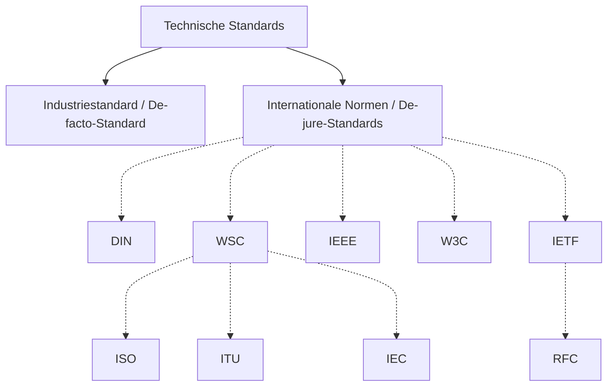

# Standards / Normen

> Wofür werden Standards benötigt?

> Welche Standards und Standardisierungsgremien kennt ihr?

## [Normen können auch Spaß machen…](https://de.wikipedia.org/wiki/Request_for_Comments#Realisierte_Aprilscherze)
